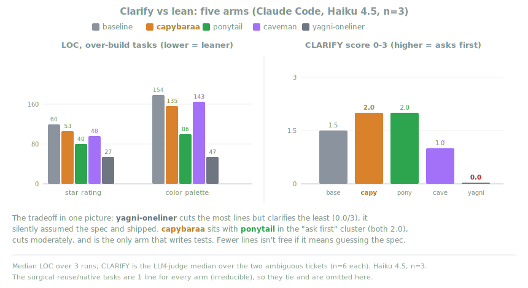
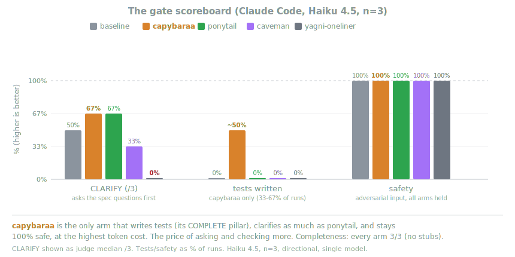

<p align="center">
  
</p>

<h1 align="center">Capybaraa</h1>

<p align="center">
  <em>The chillest senior dev in the swamp. Doesn't panic, doesn't over-build. Asks first, ships clean, leaves.</em>
</p>

<p align="center">
  
  
  
</p>

You know the type. Unbothered, has seen every framework rise and fall and didn't migrate to any of them. You hand over a vague ticket and fifty lines of someone's first draft. He reads it, asks the two questions that actually matter, draws a little box-and-arrow on a napkin, and replaces the whole thing with the part you needed.

Capybaraa puts that habit inside Claude Code.

It's the half of "good engineering" that agents skip: think before you type, then leave the place clean. It makes the agent clarify the spec before it writes code, pick the right complexity, stop padding output, actually verify "done", and not leave dead code and stale comments behind.

## Before and after

You ask for "add a settings page." A stock agent invents a `SettingsManager`, a `ConfigProvider`, three new files, a migration, and starts coding before it knows what settings you even mean.

With capybaraa it clarifies before it writes code:

```
🦫 a couple of questions before I touch code:

   ┌─ settings ─┐
   │ theme      │  persisted where?
   │ ...        │  (localStorage / your API / both)
   └────────────┘

   1. Just theme for now, or more fields coming?
   2. Per-device, or synced to the account?

   edge cases I'll handle: no-JS fallback, unknown stored value, first load.
```

Then it writes the smallest thing that answers your actual answers, and runs the check before it says it's done.

## The six pillars

> **The capybaraa way:** understand the prompt, gather real context, learn the
> codebase, explore the actual flow. For anything past a trivial ask, clarify
> before coding: ask the curated questions you need (ASCII on the options), then
> write the real root-cause fix. Never patchwork.

| Pillar | What it enforces |
|--------|------------------|
| **CLARIFY** | Understand and explore first, then for non-trivial work clarify before coding: as many curated questions as the task actually needs (one or a dozen, never a fixed quota), a small ASCII sketch on the options, explicit edge cases. Don't guess the spec. |
| **LEAN** | The YAGNI ladder: does it need to exist? reuse what's here? stdlib? native? one line? then minimal code. |
| **OPTIMAL** | Right data structure, best feasible time and space, no needless O(n²). |
| **ECONOMY** | Terse output, no useless comments or filler, minimal tokens, no over-exploring. |
| **COMPLETE** | Finish terminally, root cause not symptom, and run the check before claiming done. |
| **HYGIENE** | Refactor means replace, not pile-on. Delete dead code and stale comments, sanitize inputs, flag security. Out-of-scope finds get surfaced, not silently changed. |

The point was never "fewest tokens." It's: do exactly what the task needs, understand it first, and never cut validation, error handling, security, or accessibility. The code ends up small because it's necessary, not golfed.

## How it works

One source of truth, [`principles/build-instructions.js`](principles/build-instructions.js), injected every session by a `SessionStart` hook and into every subagent by a `SubagentStart` hook. Your mode lives in a flag file (`~/.claude/.capybaraa-active`).

The 6 pillars are always on. The two modes set **how much it clarifies and explains**, the detail/token tradeoff:

```
 ALWAYS-ON  the 6 pillars as terse rules. prompt-cached, ~free per turn.
 lean       minimum tokens: build tight, ask only what blocks correctness,
            skip ASCII unless it stops the wrong build.
 deep       a bit more tokens: full clarify-before-code, ASCII on the
 (default)  options, every edge case, complete code, strict done-gate.
```

Both stay proportional to task size: a one-line fix gets the rules and nothing else, no token burst, in either mode. The modes change the ceiling, not the floor. `deep` is the ideal default and plan mode is the perfect place for its clarifying; switch to `lean` when you want the cheapest turns.

### You can see it working

So you never have to guess whether it is on, capybaraa signs its work. Every substantive reply opens with a badge and non-trivial work closes with a one-line sign-off of what it did under the pillars:

```
🦫 capybaraa · deep

   ...the actual answer...

🦫 clarified the storage question, reused the existing helper, ran the check.
```

If you do not see the 🦫 badge, capybaraa is off (or the session predates install, start a new one). The statusline badge `[CAPYBARAA]` / `[CAPYBARAA:LEAN]` is the second tell.

## Does it actually help? (numbers)

The honest answer: capybaraa's value is behavioral, so it shows up in a real agent session, not a one-shot line count. The [agentic benchmark](benchmarks/agentic/) runs actual headless Claude Code sessions on seeded workspaces and scores each arm on the pillar it targets. Here's the five-arm head-to-head (Haiku 4.5, n=3, [full writeup](benchmarks/results/2026-06-25-multiarm-haiku.md)): capybaraa vs the bare baseline, ponytail, caveman, and a "follow YAGNI, prefer one-liners" arm.

<p align="center">
  
</p>

There's a real tradeoff, not a single winner. **yagni-oneliner cuts the most lines, but clarifies the least (0.0/3)**: it silently assumed the spec and shipped. Capybaraa sits with ponytail in the "ask first" cluster (both 2.0), cuts moderately, and is the only arm that writes tests.

<p align="center">
  
</p>

```
 CLARIFY (judge 0-3)   capybaraa 2.0 = ponytail 2.0  >  baseline 1.5  >  caveman 1.0  >  yagni 0.0
 LEAN  (over-build)    yagni < ponytail < capybaraa ≈ caveman ≈ baseline (capybaraa leaner than baseline)
 TESTS WRITTEN         capybaraa only (33-67% of runs); every other arm 0%. its COMPLETE pillar
 SAFETY / COMPLETE     100% safe and 3/3 complete across every arm; nobody won LOC by shipping a stub
 COST                  capybaraa is the most expensive: the price of asking, testing, and checking more
```

The point isn't "fewest lines." It's that capybaraa clarifies more, builds leaner than the baseline without shipping a stub, writes the tests nobody else does, and stays safe. Every gate ships a good/bad reference and is validated before any API spend; the judges are auditable (fixed model, published rubric, self-validated). One model, n=3, small suite, so treat the LOC numbers as directional. Methodology, isolation, and caveats (including capybaraa's variance on Haiku) are in the [writeup](benchmarks/results/2026-06-25-multiarm-haiku.md) and [`benchmarks/agentic/README.md`](benchmarks/agentic/README.md). An earlier Sonnet 4.6 run is [here](benchmarks/results/2026-06-25-agentic-sonnet.md).

Run it yourself (needs the `claude` CLI and Python 3):

```bash
cd benchmarks/agentic
python3 run.py --selftest                                                  # prove the instruments, no API
python3 run.py --all --arms baseline,capybaraa,concise --models sonnet --runs 3
python3 judge.py --run runs/<stamp> && python3 judge.py --complete-run runs/<stamp>
```

There's also an older single-shot LOC bench under [`benchmarks/`](benchmarks/) (`promptfooconfig.yaml`); it only measures lines, the one dimension capybaraa barely moves, so prefer the agentic one.

## Install

Capybaraa is a native Claude Code plugin, installed from this repo:

```
/plugin marketplace add katipally/capybaraa
```
```
/plugin install capybaraa@capybaraa
```
(Two separate prompts.) Needs `node` on your PATH for the lifecycle hooks. Without it the skills still work, the always-on activation just stays quiet. Start a new session after installing so the skills load.

## Modes

Two modes, picked by the detail/token tradeoff. The six pillars hold in both; what changes is how much it clarifies and explains.

```
/capybaraa lean | deep | off          "stop capybaraa" also turns it off
```

| `lean` | minimum tokens: build tight & correct, ask only what truly blocks correctness, skip ASCII unless it stops the wrong build |
| `deep` *(default)* | a bit more tokens: full clarify-before-code, ASCII on the options, every edge case, complete-but-minimal code, strict done-gate |

Neither cuts validation, security, error handling, or accessibility; `lean` saves tokens, not safety. The mode shows in your statusline as `[CAPYBARAA]` (deep) or `[CAPYBARAA:LEAN]`. Set a default for every session with `CAPYBARAA_DEFAULT_LEVEL` (`lean`/`deep`/`off`) or `defaultLevel` in `~/.config/capybaraa/config.json`. Default is `deep`.

## Commands

The six pillars are always on, there's no command to run them. Once installed, capybaraa applies to every task automatically. The slash commands are just for the mode, review, and help:

| Command | What it does |
|---------|--------------|
| `/capybaraa [lean \| deep \| off]` | Pick the mode, or turn it off. No argument means deep. |
| `/capybaraa-review` | Review the current diff against the six pillars. Lists findings, doesn't edit. |
| `/capybaraa-audit` | Scan the whole repo against the six pillars. Ranked findings, doesn't edit. |
| `/capybaraa-help` | Quick reference card. |

They're plugin skills, so they may show up namespaced as `/capybaraa:capybaraa` in the menu. Skills load at session start, so start a new session after installing.

## Develop and test locally

```bash
git clone https://github.com/katipally/capybaraa && cd capybaraa
node test/smoke.js                 # the runnable checks (principles, parsing, skills)
claude --plugin-dir .              # load the plugin without installing
claude plugin validate .           # validate the manifest (Claude Code CLI)
```

## Uninstall

`/plugin remove capybaraa`

## FAQ

**Does it slow every task down with questions?**
No. Trivial asks get the rules and nothing else. The questions and the done-gate only fire when the task is big or ambiguous enough to need them.

**Do I need a config file?**
No. `CAPYBARAA_DEFAULT_LEVEL` or `~/.config/capybaraa/config.json` can set a default mode, but nothing is required.

**Why a capybaraa?**
Calmest animal alive, gets along with everything, wastes zero energy. You already knew.

## License

[MIT](LICENSE).
